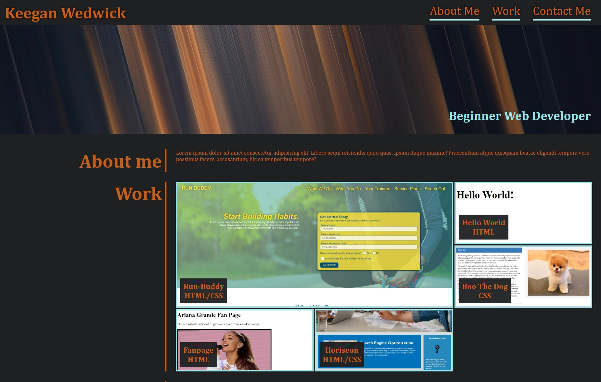

# Portfolio

Starting Portfolio using HTML and CSS.

## Table of Contents

- [Scope](#scope)
- [HTML](#html)
- [CSS](#css)
- [Problem](#problem)
- [Screenshot](#screenshot)

## Scope

- For this week's challenge, we needed to craft a website from scratch only using CSS, HTML, and a photo of what it should look like. Ideally, it would have what a future employer would need to see my web development skills.

Link to live URL project: https://kwedwick.github.io/Portfolio/

Link to Github Repo: https://github.com/kwedwick/Portfolio 

## HTML

First step was to craft all the HTML that I would need to sculpt using CSS.

1. Initially, I didn't realize I should have started with CSS grid. I tried to flexbox into a one column by three rows and then CSS them to all line up. 
    * This did not work after hours of trying. I grew out the website layout again on a sheet of paper and saw that I needed CSS grid properties

2. I revamped the whole HTML containers and left them as 6 individual grids under the "main" element body.
    * I later came back to the grid-wrapper and grid-container to change them slightly. When this part was left, I wrapped the text in a "p" tag to better control the text and background

## CSS

1. My goal was to keep all my CSS in order that it appears in HTML for better readability and quicker access.
2. This part was very challenging the first two days I was working on it. I didn't understand which containers are applying flex/flexbox/grid - a lot of trial and error and googling helped better solve this
3. The images displayed on the webpage are linked to a specific CSS class. Initially I thought this was the better method but turned out it hindered what I could do with special effects as it would affect the text in the "a"/"p" tags in the WORK section.
4. Mediaqueries were formated to be responsive started with the iPad. Things were to flex right away and adjust text size
    * This was challenging at first when using CSS grid for the main body as it needed to become flex, and then adjust all of the containers.

## Problem

1. The major issue I had was the images linked to a class. I would revamp the HTML and CSS for better manipulation in the future. Unfortuately, I don't have enough time before the deadline to devote to this change. I would create two divs, one for img and one for text, and then using one CSS img class, I would use that to use transition/opacity/blur effects without it blanket covered the whole single "div" grid-item like it does now.
2. There may be a "head nav a" text color upon first load. I can no longer test this because it's now cached somewhere. Would need to figure out how to delete cache to reload the page fresh.

## Screenshot

Here is the screenshot of the final webpage:
